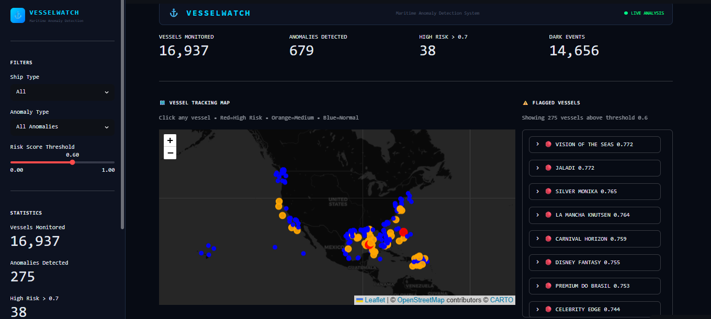
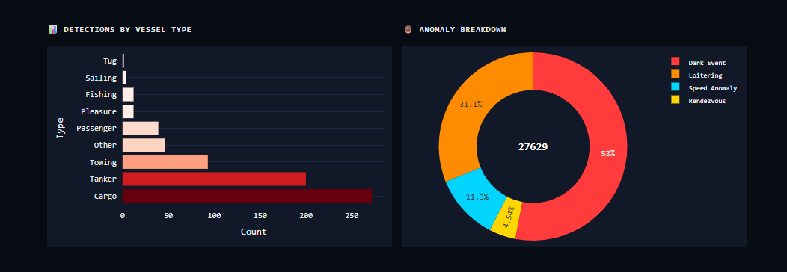
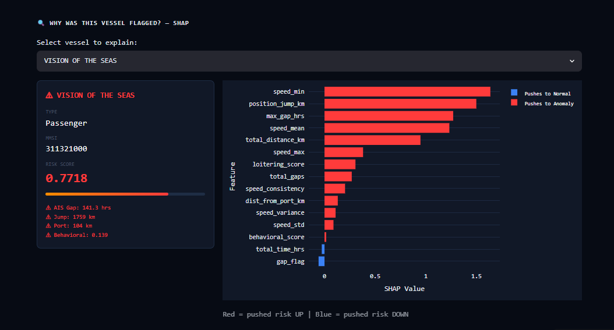
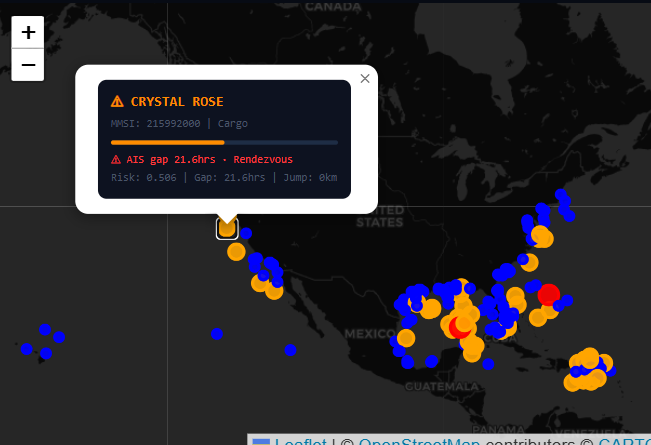

# ⚓ VesselWatch
### Maritime Anomaly Detection Using Machine Learning

[](https://vesselwatch-vmzc2tetunqfqmv7wgblw7.streamlit.app/)
[](https://python.org)
[](https://streamlit.io)

---

VesselWatch processes **5.6 million real AIS vessel tracking records** to automatically detect suspicious ship behavior — dark voyages, illegal rendezvous, loitering, and more. Every flagged vessel comes with a SHAP-based explanation so analysts know *why* it was flagged, not just that it was.

**[👉 Open the live dashboard](https://vesselwatch-vmzc2tetunqfqmv7wgblw7.streamlit.app/)**


*Live map showing vessels — red = high risk, orange = medium, blue = normal. Flagged vessels listed by risk score on the right.*

---

## The Problem

Thousands of ships cross the world's oceans every day. Coast guards cannot monitor all of them manually. Criminals exploit this — they turn off GPS mid-ocean, transfer illegal cargo between ships, then reappear looking completely normal.

Rule-based systems fail because criminals learn the rules. **VesselWatch learns what normal looks like — and flags everything that deviates, automatically.**

---

## Results

| Metric | Value |
|--------|-------|
| Vessels analyzed | **13,043** |
| Suspicious vessels flagged | **764** |
| Precision | **98.43%** |
| Recall | **89.84%** |
| F1 Score | **93.94%** |
| ROC-AUC | **0.9905** |

### Behavioral validation

|  | 🔴 High risk vessels | 🟢 Normal vessels |
|--|--|--|
| Avg AIS gap | **59.47 hrs** | 23.82 hrs |
| Avg position jump | **1,315 km** | 24 km |
| Avg distance from port | **230 km** | 22 km |

> High-risk vessels jump **54× further** than normal vessels after an AIS gap — confirming the model correctly identifies genuinely suspicious behavior, not random noise.

---

## What Gets Detected

| Signal | Description |
|--------|-------------|
| 🔴 **Dark events** | Ship disappears from radar mid-ocean with no AIS signal |
| 🟠 **Position jumps** | Vessel reappears far from its expected location |
| 🔵 **Rendezvous** | Two ships meet in open ocean — possible cargo transfer |
| 🟣 **Loitering** | Ship circles the same area for extended hours |
| ⚡ **Speed anomalies** | Erratic or physically impossible speed changes |
| 🧠 **Behavioral shift** | Vessel acts differently from its own 7-day baseline |


*Left: anomaly detections by vessel type — cargo and tankers dominate. Right: dark events account for 53% of all anomalies detected.*

---

## ML Pipeline

```
5.6M Raw AIS Pings (7 days)
        │
        ▼
┌─────────────────────┐
│    Data Cleaning     │  Remove invalid MMSIs · Fix sensor errors · Deduplicate
└─────────────────────┘
        │
        ▼
┌─────────────────────┐
│ Feature Engineering  │  32 behavioral features per vessel
│                     │  Interaction features · Vessel-type Z-scores
│                     │  Each vessel fingerprinted against its own history
└─────────────────────┘
        │
        ▼
┌─────────────────────────────────────────┐
│       Unsupervised Anomaly Detection     │
│                                         │
│  Isolation Forest  ──  outlier scores   │
│  DBSCAN  ──────────  rendezvous flags   │
│  LSTM Autoencoder  ──  trajectories     │
└─────────────────────────────────────────┘
        │
        ▼
┌─────────────────────────────────────────┐
│         Supervised Stacking (V3)         │
│                                         │
│  GradientBoosting + RandomForest         │
│  Trained on features + unsupervised      │
│  scores with SMOTE class balancing       │
└─────────────────────────────────────────┘
        │
        ▼
┌─────────────────────┐
│  SHAP Explainability │  Why was this vessel flagged?
│                     │  Per-feature contribution scores for every result
└─────────────────────┘
        │
        ▼
┌─────────────────────┐
│ Interactive Dashboard│  Live map · Risk filters · SHAP charts · Vessel drill-down
└─────────────────────┘
```

---

## Key V3 Improvements

| # | Improvement | Impact |
|---|-------------|--------|
| 1 | **Supervised stacking** — GradientBoosting + RandomForest on top of Isolation Forest scores | Primary precision/recall boost |
| 2 | **Multi-signal pseudo-labels** — requires 2+ suspicious signals instead of any single threshold | Eliminates false labels |
| 3 | **7 interaction features** — `gap×jump`, `gap×port_dist`, `speed_range`, etc. | Captures compound patterns |
| 4 | **5 vessel-type Z-scores** — flags vessels deviating from their own type's baseline | Type-aware detection |
| 5 | **SMOTE class balancing** — synthetically oversamples rare anomalies | Prevents majority-class bias |
| 6 | **Optimal threshold from PR curve** — instead of hardcoded 0.55 | Maximizes F1 automatically |
| 7 | **AIS gap threshold raised** from 2 → 6 hours | Removes noise from normal gaps |

---

## SHAP Explainability

Every flagged vessel comes with a full breakdown of which features drove the risk score — and in which direction.


*VISION OF THE SEAS (risk score 0.77): minimum speed and position jump are the dominant anomaly drivers. Red bars push risk up, blue push it down.*


*Clicking any vessel on the map shows its MMSI, type, AIS gap, rendezvous flag, risk score, and position jump — inline, without leaving the dashboard.*

---

## Tech Stack

| Layer | Tools |
|-------|-------|
| Data processing | Python · Pandas · NumPy |
| Machine learning | Scikit-learn · TensorFlow · Keras · imbalanced-learn |
| Explainability | SHAP |
| Mapping | Folium · GeoPandas |
| Dashboard | Streamlit |
| Deployment | Streamlit Cloud |

---

## Most Suspicious Vessels Found

| Vessel | Type | AIS Gap | Position Jump |
|--------|------|---------|---------------|
| EVER LUCENT | Cargo | 117 hrs | 4,143 km |
| MARJORIE C | Cargo | 118 hrs | 3,613 km |
| SILVER MONIKA | Tanker | 118 hrs | 2,274 km |
| LA MANCHA KNUTSEN | Tanker | 69 hrs | 1,776 km |

---

## Repository Structure

```
VesselWatch/
├── app.py                              ← Streamlit dashboard entry point
├── requirements.txt                    ← Python dependencies
├── runtime.txt                         ← Python version for deployment
├── final_results.csv                   ← ML outputs for 13,043 vessels
├── shap_explanations.csv               ← SHAP values for top 50 flagged vessels
├── README.md
├── pipeline/                           ← V3 modular ML pipeline
│   ├── __init__.py
│   ├── config.py                       ← Constants, paths, hyperparameters
│   ├── data_loader.py                  ← Load AIS CSVs, train/test split, cleaning
│   ├── feature_engineering.py          ← 32 features: speed, gaps, interactions, Z-scores
│   ├── labels.py                       ← Multi-signal pseudo-label generation
│   ├── models.py                       ← IF, DBSCAN, LSTM, supervised stacking
│   ├── evaluation.py                   ← Cross-validation, metrics, visualization
│   └── run_pipeline.py                 ← Main runner — orchestrates everything
└── assets/
    ├── dashboard.png
    ├── analytics.png
    ├── shap.png
    └── map_popup.png
```

---

## Run Locally

```bash
# Clone the repo
git clone https://github.com/JenishPatoliya/VesselWatch
cd VesselWatch

# Install dependencies
pip install -r requirements.txt

# Launch the dashboard
streamlit run app.py
```

Then open [http://localhost:8501](http://localhost:8501) in your browser.

---

## Author

**Jenish Patoliya**
📧 [jenishpatoliya1911@gmail.com](mailto:jenishpatoliya1911@gmail.com)
🐙 [github.com/JenishPatoliya](https://github.com/JenishPatoliya)

---

<div align="center">Built for maritime security · Powered by real AIS data</div>
